- **Śrīla Bhakti Sundar Govinda Dev-Goswāmī Mahārāj**
  - https://kirtan.site/en-2026/gurvabhishta-supurakam-guru-ganair
    - 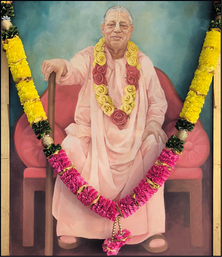
- **Śrīla Bhakti Rakṣak Śrīdhar Dev-Goswāmī Mahārāj**
  - https://kirtan.site/en-2026/devam-divya-tanum-suchanda-vadanam-balarka-chelanchitam
    - 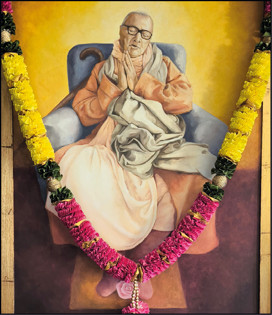
- **Bhagavān Śrīla Bhakti Siddhānta Saraswatī Ṭhākur**
  - https://kirtan.site/en-2026/shri-siddhanta-sarasvatiti-vidito
    - 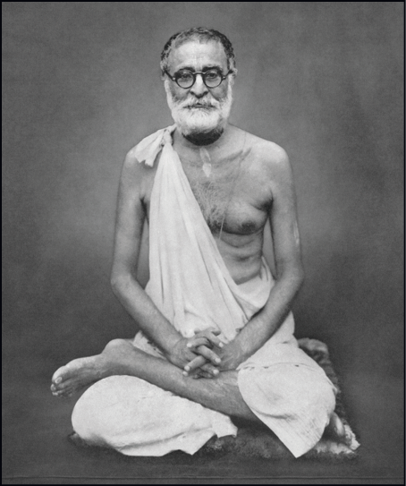
- **Śrīla Gaura Kiśor Dās Bābājī**
  - https://kirtan.site/en-2026/namo-gaurakishoraya-bhaktavadhuta-murtaye
    - 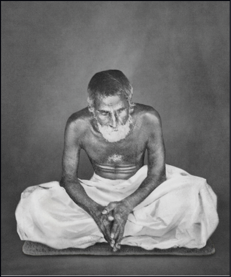
- **Śrīla Sachchidānanda Bhakti Vinod Ṭhākur**
  - https://kirtan.site/en-2026/vande-bhaktivinodam-shri-gaura-shiakti-svarupakam
    - 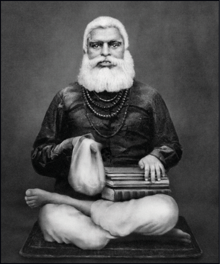
- **Śrīla Jagannāth Dās Bābājī**
  - https://kirtan.site/en-2026/gaura-vrajashritashieshair-vaishnavair-vandya-vigraham
    - 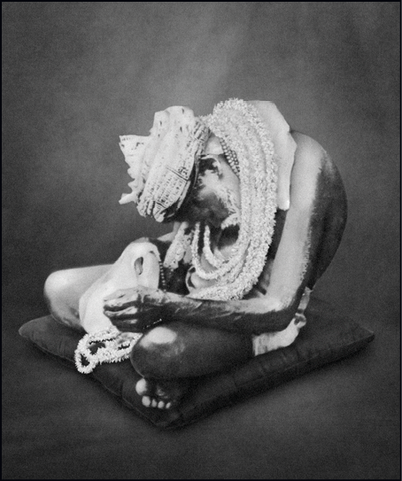
- **Śrī Śrī Guru Gaurāṅga Rādhā Madana-Mohanjīu**
  - https://kirtan.site/en-2026/jayatam-suratau-pangor
    - 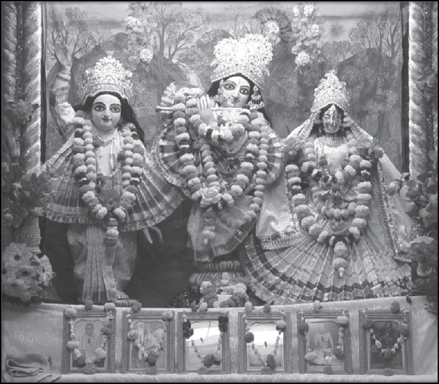
- **Śrī Śrī Guru-Gaurāṅga-Gāndharvā-Govindasundarjīu**
  - https://kirtan.site/en-2026/divyad-vrindaranya-kalpa-drumadhah
    - 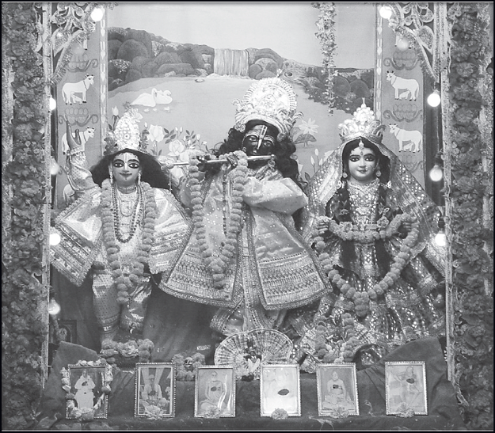
- **Śrī-Śrī-Guru-Gaurāṅga-Rādhā-Gopīnāthjīu**
  - https://kirtan.site/en-2026/shriman-rasa-rasarambhi
    - 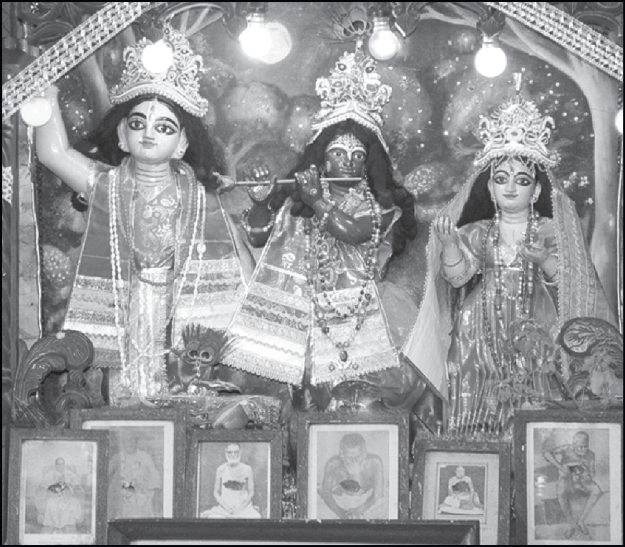
- **Śrīla A.C. Bhaktivedānta Swāmī Prabhupād**
  - https://kirtan.site/en-2026/namah-om-vishnupadaya-krishna
    - 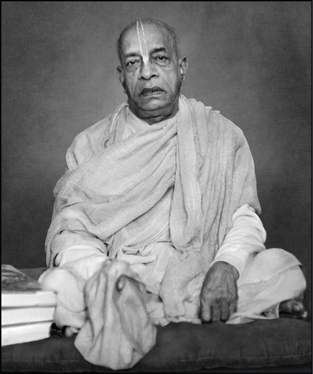
- **The Glory of Śrī Chaitanya Sāraswat Maṭh**
  - https://kirtan.site/en-2026/shrimach-chaitanya-sarasvata-mathavara-udgita-kirtir
    - 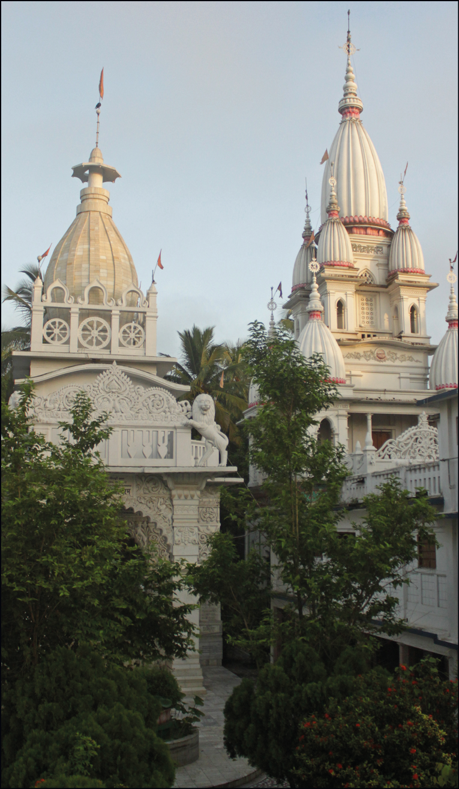

